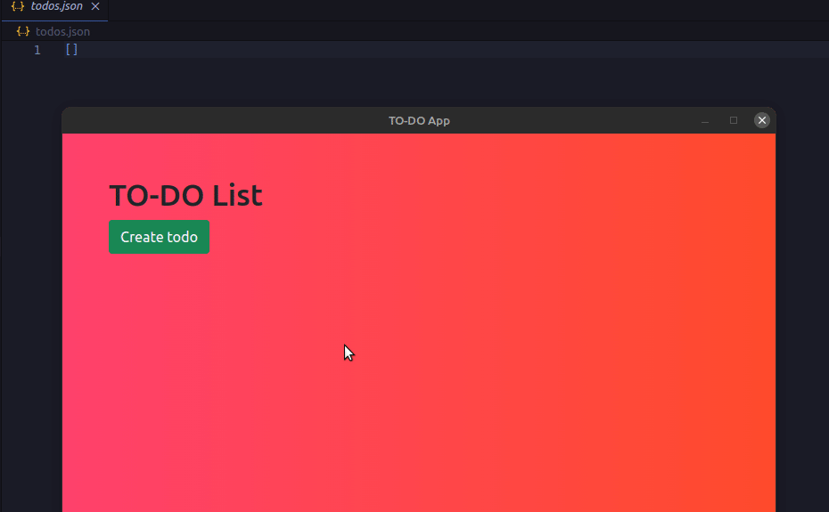

# electron-todo
A simple Todo app I made while learning Electron.

---
## Features
- You can create a new to do with `CTRL + N` shortcut.
- Data is saved in a local JSON file.

---

## GIF


---

## Development
### Install Repository
```git
git clone https://github.com/boraoksuzoglu/todo-app-electron
```

### Install node modules
```
npm install
```
### Run!
```
npm run start
```